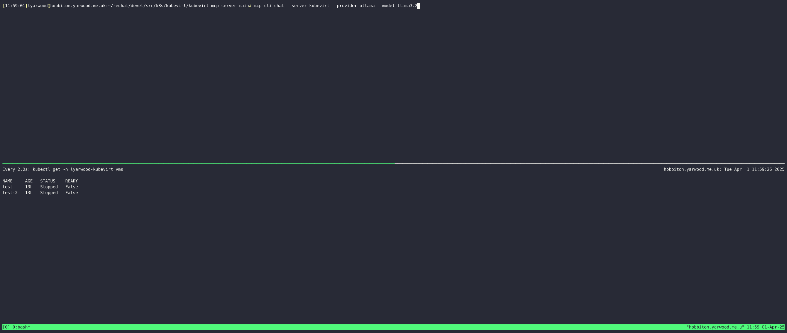

# kubevirt-mcp-server

A simple Model Context Protocol server for KubeVirt.

## Architecture

The project is organized into modular packages:

- `main.go` - MCP server setup and registration
- `pkg/client/` - Shared KubeVirt client utilities
- `pkg/tools/` - MCP tool handlers for VM operations
- `pkg/resources/` - MCP resource handlers for structured data access
- `scripts/kubevirtci.sh` - Script for managing local kubevirtci development environment
- `scripts/sync.sh` - Script for building and running MCP server locally with kubevirtci access
- `Makefile` - Build automation and development tasks

## Features

### MCP Tools
- `list_vms` - List virtual machine names in a namespace
- `start_vm` - Start a virtual machine
- `stop_vm` - Stop a virtual machine
- `list_instancetypes` - List available instance types
- `get_vm_instancetype` - Get instance type for a VM

### MCP Resources
- `kubevirt://{namespace}/vms` - JSON list of VMs with summary info
- `kubevirt://{namespace}/vm/{name}` - Complete VM specification
- `kubevirt://{namespace}/vmis` - JSON list of VMIs with runtime info
- `kubevirt://{namespace}/vmi/{name}` - Complete VMI specification

## Building

```bash
# Using Makefile (recommended)
make build

# Or directly with go
go build -o kubevirt-mcp-server .
```

## Development

### Available Make Targets
- `make build` - Build the binary (default)
- `make clean` - Clean build artifacts  
- `make test` - Run tests with Ginkgo framework
- `make coverage` - Generate test coverage report
- `make fmt` - Format Go code
- `make vet` - Run go vet
- `make lint` - Run golangci-lint
- `make deps` - Download and tidy dependencies
- `make run` - Build and run the server
- `make check` - Run fmt, vet, lint, and test
- `make cluster-up` - Start kubevirtci cluster for testing
- `make cluster-down` - Stop kubevirtci cluster
- `make cluster-sync` - Build and run MCP server locally with kubevirtci access
- `make test-functional` - Run functional tests against MCP server
- `make help` - Show help message

### Testing

The project uses the [Ginkgo](https://github.com/onsi/ginkgo) testing framework with [Gomega](https://github.com/onsi/gomega) assertions:

```bash
# Run unit tests
make test

# Generate test coverage report
make coverage

# Run functional tests against MCP server
make test-functional

# Run linter
make lint

# Run all quality checks
make check
```

### Local Development Environment

For functional testing with a real KubeVirt cluster, use the kubevirtci integration:

```bash
# Start a local kubevirtci cluster with KubeVirt
make cluster-up

# Stop the cluster when done
make cluster-down

# Build and run MCP server locally with cluster access
make cluster-sync
```

The kubevirtci integration includes:

**`scripts/kubevirtci.sh`** handles:
- Downloading and setting up kubevirtci
- Starting a local Kubernetes cluster with KubeVirt and CDI
- Configuring the environment for testing
- Providing access to kubectl, kubeconfig, and registry

**`scripts/sync.sh`** handles:
- Building the MCP server binary
- Setting up proper KUBECONFIG environment for kubevirtci access
- Providing instructions for local MCP server execution

### Test Structure

The project includes comprehensive test coverage:

- **Unit Tests** - Test individual components in isolation
  - `pkg/client/client_test.go` - KubeVirt client creation tests
  - `pkg/tools/tools_test.go` - MCP tool handler argument validation
  - `pkg/resources/resources_test.go` - MCP resource handler URI parsing

- **Functional Tests** - Test complete MCP server functionality
  - `tests/functional/functional_suite_test.go` - Test suite setup and KubeVirt cluster verification
  - `tests/functional/mcp_server_stdio_test.go` - Complete MCP server API coverage:
    - MCP server initialization and JSON-RPC communication
    - All MCP tools: list_vms, start_vm, stop_vm, restart_vm, list_instancetypes, get_vm_instancetype
    - All MCP resources: kubevirt://namespace/vms, vm/name, vmis, vmi/name endpoints
    - Error handling for invalid tools, missing arguments, invalid URIs, and non-existent VMs

## Demo

This short demo uses mcp-cli as a bridge between the kubevirt-mcp-server and LLM.

The model used by the demo is llama3.2 running locally under ollama.



## Links 

- https://www.anthropic.com/news/model-context-protocol
- https://github.com/mark3labs/mcp-go
- https://github.com/chrishayuk/mcp-cli
